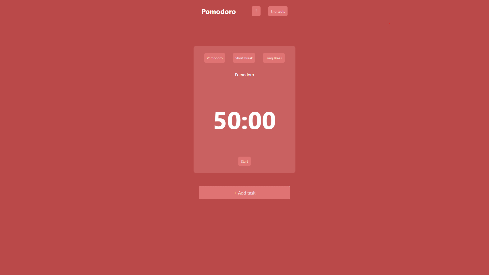

# Pomodoro WebSite with React
- 🧐 The Pomodoro Technique is created by Francesco Cirillo for a more productive way to work and study. The technique uses a timer to break down work into intervals, traditionally 25 minutes in length, separated by short breaks.

- Used primarily Context API useState and UseEffect hooks
- Unit tests with react testing library and jest
- The tests checks if the component was rendered and their buttons calls their respective functions
- Used localStorage to maintain the settings and tasks state

  # Stack
  
  
  
  
  
  
   
  

- You can see the project online at [pomodoro-app](https://pomodoro-react-app.vercel.app)

# Running the application locally
- Follow the steps below to run the application locally using Docker:
    1. Clone the repository:
        - `git clone https://github.com/LuisFabianod/pomodoroReactApp.git`
    2. Make sure that you are in the application directory:
        - `cd pomodoro-app`
    3. Run development script:
        - `npm start`
    4. Run tests script:
        - `npm test`

# Running the application locally with Docker
- Follow the steps below to run the application locally using Docker:
    1. Clone the repository:
        - `git clone https://github.com/LuisFabianod/pomodoroReactApp.git`
    2. Build the Docker image:
        - `docker build -t pomodoro-app .`
    3. Run the application container:
        - `docker run --name pomodoro-container pomodoro-app`
    4. Copy the built files to the host:
        - `docker cp pomodoro-container:/var/www/html ./build`
    5. Run the Nginx container to serve the application::
        - `docker run -d -p 8080:80 --name nginx-container -v $(pwd)/build:/usr/share/nginx/html:ro -v $(pwd)/nginx.conf:/etc/nginx/conf.d/default.conf:ro nginx:alpine`
    6. Access the application:
        - Open your browser and go to http://localhost:8080.
